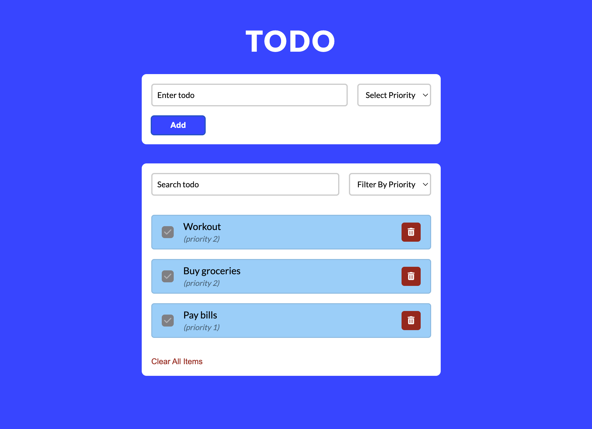

# TODO app

### Description

Simple todo app.

### Features

- Add items with description and priority.
- Edit items.
- Mark items as done.
- Remove item / clear all items.
- Search function to search for items.
- Filter by priority.
- Uses local storage.

### Built With

- HTML.
- CSS.
- Vanilla Javascript.

### Links

- GitHub URL: [https://github.com/norrland90/todo-list]
- Live Site URL: [https://norrland90.github.io/todo-list]

### Status

Project is: _finished_.

### Contact

Created by [@norrland90](https://github.com/norrland90) - feel free to contact me!

### Acknowledgement

Inspiration from Shopping List Project in course "Modern JavaScript From The Beginning 2.0" by [TraversyMedia](https://www.traversymedia.com/).
